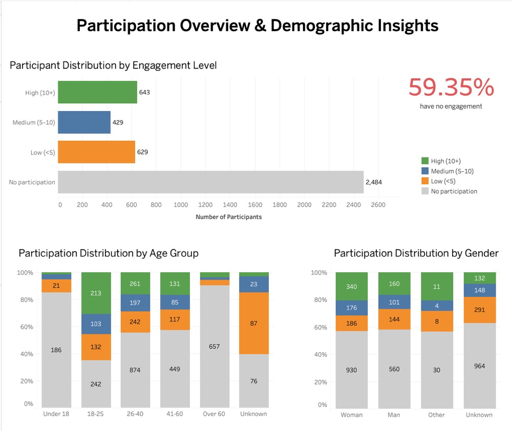
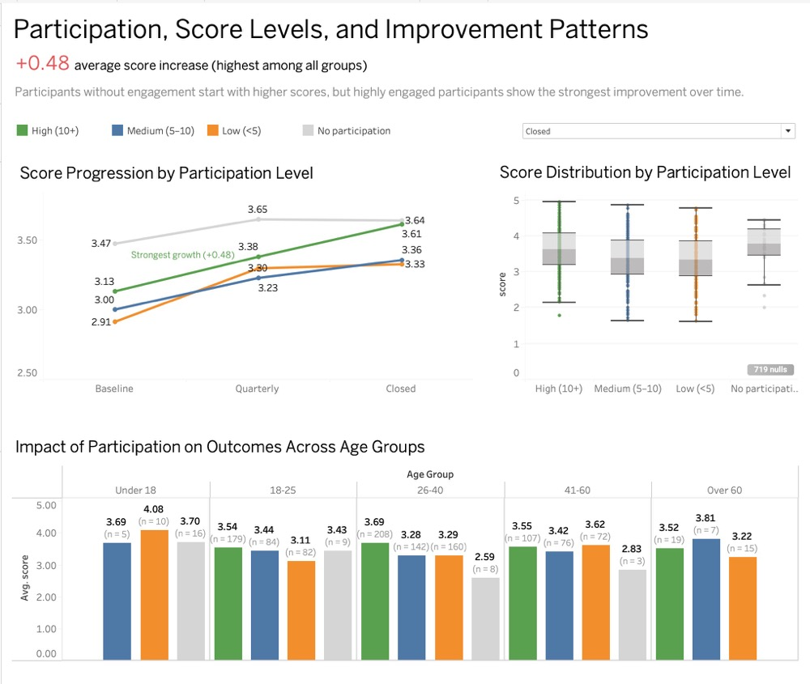

# Impact of Program Engagement on Participant Outcomes

## 🔍 Project Overview

This project analyzes how participant engagement in goal-setting programs relates to outcome scores across different demographic groups and time periods.

The goal is to move beyond simple performance comparison and understand:

- Who participates in the program
- How engagement varies across demographics
- Whether participation leads to better outcomes or stronger improvement

---

## Key Insight

> The biggest challenge is not performance — it is participation.

**59.35% of participants (2,484 individuals) show no engagement in goal-setting programs at all**, revealing a critical gap in goal-setting programs adoption.

---

## 📊 Dashboard 1 — Participation Overview

### 🔍 Focus

- Distribution of engagement levels  
- Participation across age groups  
- Participation across gender  

---

## 🧠 Key Insights (Participation)

### 🔴 1. Critical Engagement Gap

59.35% of participants are not engaged in the goal-setting programs.

This suggests a major barrier in:
- goal-setting programs accessibility  
- awareness  
- or motivation  

---

### 🟢 2. Engagement Peaks in Young Adults (18–40)

Participants aged **18–40** show the highest engagement levels in goal-setting programs, with a strong presence in the High (10+) group.

👉 Indicates this group is more responsive to goal-setting programs.

---

### 🟠 3. Low Engagement in Under 18 and Over 60 Groups

Both **Under 18** and **Over 60** groups are dominated by non-participation in goal-setting programs.

👉 Suggests:
- potential accessibility barriers  
- lack of program relevance for these age groups  

---

### 🔵 4. Gender-Based Participation Differences

- Women show slightly higher engagement than men  
- Participants with **unknown gender** have the lowest engagement  

👉 This may indicate a relationship between:
- incomplete data  
- and disengagement  

---

### ⚪ 5. Highly Engaged Users Are a Minority

Although critical to program success, highly engaged participants in goal-setting programs represent only a small portion of the total population.

👉 The biggest opportunity lies in activating the non-participating in goal-setting programs majority.

---

## 📊 Dashboard 2 — Outcomes & Engagement Impact

### 🔍 Focus

- Score progression over time (Baseline → Quarterly → Closed)  
- Score distribution across participation groups  
- Outcome differences across age groups  

---

## 🧠 Key Insights (Outcomes)

### 📈 1. High Participation Drives Strongest Improvement

Participants in the **High (10+) group** show the largest score increase over time:

👉 **+0.48 average increase**

This indicates that engagement plays a key role in **growth**, not just performance.

---

### ⚖️ 2. No Participation Group Starts Higher but Improves Less

Participants with no engagement often have higher baseline scores.

However:

- Their improvement over time is minimal  
- Their performance remains relatively flat  

👉 Suggests they may already be higher-performing but not benefiting from the program.

---

### 📊 3. Engagement Improves Consistency

High participation groups show:

- more stable score distributions  
- fewer extreme variations  

👉 Indicates more consistent outcomes among engaged users.

---

### 👥 4. Age Differences Remain Important

Across age groups:

- Engagement continues to influence outcomes  
- Some groups show smaller sample sizes (less reliable trends)

👉 Reinforces the need for demographic-specific strategies.

---

## 🧠 Interpretation

This analysis highlights an important distinction:

- Engagement does not always produce the highest final scores  
- But it strongly contributes to **score improvement and consistency**

👉 The program appears to be more effective as a **growth tool** rather than a performance differentiator.

---

## ⚠️ Limitations

- Missing data in baseline and closing assessments  
- Small sample sizes in some age groups  
- Observational data — no causal conclusions  

---

## 🛠️ Tools & Technologies

- **R** — data cleaning and transformation  
- **Tableau** — data visualization and dashboard design  

---

## 💬 Reflection

This project helped me move beyond describing data to interpreting it.

Instead of focusing only on *what the data shows*, I focused on:

- identifying underlying problems  
- distinguishing between performance and improvement  
- connecting insights to real-world implications  

---

## 🚀 Next Steps

Future exploration could include:

- Identifying drivers of engagement  
- Designing targeted interventions for low-engagement groups  
- Evaluating program effectiveness across different user segments  

